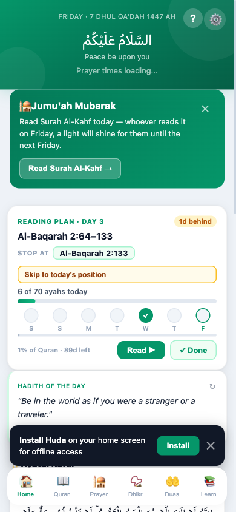
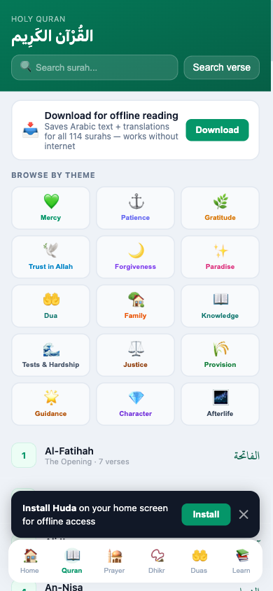
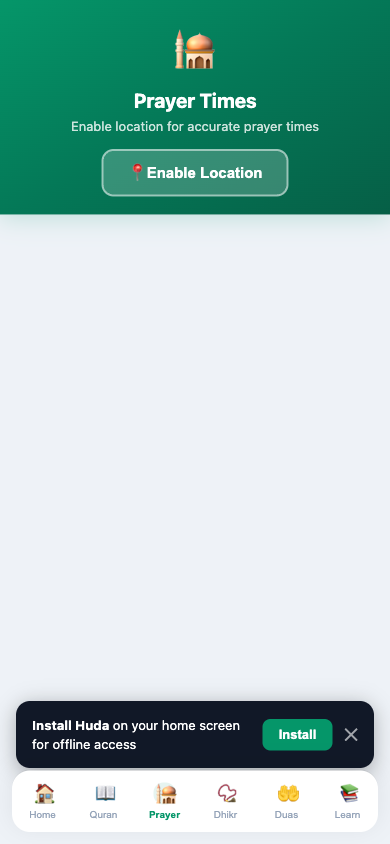
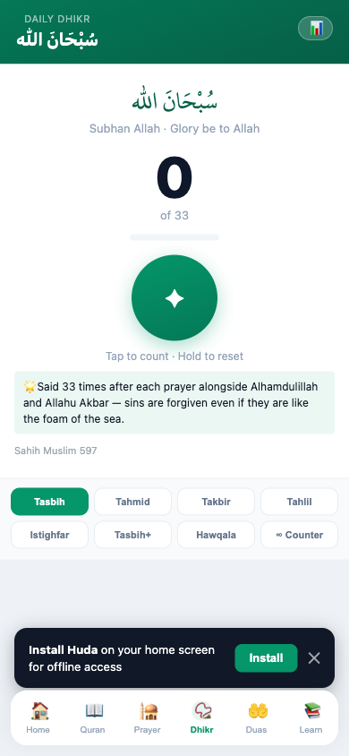
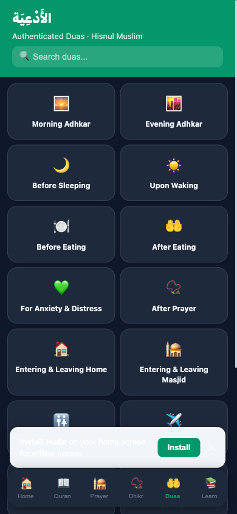
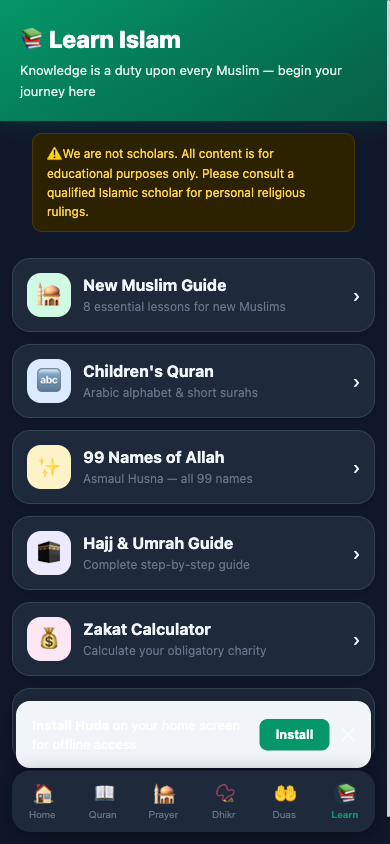

# Huda — Islamic Companion

A free, offline-first Progressive Web App (PWA) for Muslims. Built with vanilla JS — no frameworks, no build step.

**Live app → [huda-six.vercel.app](https://huda-six.vercel.app)**

---

## Screenshots

| Home | Quran | Prayer |
|------|-------|--------|
|  |  |  |

| Dhikr | Duas | Learn |
|-------|------|-------|
|  |  |  |

---

## Features

- **Quran** — Full Arabic text (Uthmanic script) with English translation, gapless audio, 5 reciters, auto-scroll, ayah highlighting, Mushaf page view, bookmarks, tafsir, offline download for all 114 surahs
- **✦ Ayah Explanation** — AI-generated tafsir for any ayah: plain meaning, historical context, word study with Arabic root, and scholar insight from Ibn Kathir / Al-Tabari / Maududi. Available from study view, Mushaf view, and the home screen Ayatul Kursi card
- **Prayer Times** — GPS-accurate prayer times, live countdown, Qibla compass, prayer notification reminders
- **Dhikr** — Morning & evening adhkar, free tasbeeh counter, daily streak tracking
- **Duas** — 200+ authentic duas from Hisnul Muslim, categorised and searchable, including duas from 9 Prophets
- **Reading Plan** — 30-day, 3-month, or 1-year Quran completion plans with daily progress, streak calendar, and midnight auto-refresh
- **Learn** — New Muslim Guide, 99 Names of Allah, Children's Quran (Arabic alphabet + short surahs), Hajj & Umrah Guide, Zakat Calculator, Islamic Calendar
- **Dark mode** — Full dark theme
- **Offline** — Works without internet after first load (service worker caching)

## Tech Stack

| Layer | Tech |
|---|---|
| Frontend | Vanilla JS, HTML, CSS (no framework) |
| Auth & Database | [Supabase](https://supabase.com) |
| AI (Ayah Explanation) | Claude Haiku via Supabase Edge Function |
| Hosting | [Vercel](https://vercel.com) |
| Audio | [EveryAyah](https://everyayah.com) / [QuranicAudio](https://download.quranicaudio.com) |
| Quran Data | [AlQuran Cloud API](https://alquran.cloud) |
| Prayer Times | [Adhan.js](https://github.com/batoulapps/adhan-js) |

## Getting Started

No build step needed. Clone and open directly in a browser or serve with any static file server.

```bash
git clone https://github.com/Cruncho24/Huda.git
cd Huda
# open index.html in your browser, or:
npx serve .
```

## Project Structure

```
Huda/
├── index.html                        # App shell
├── css/styles.css                    # All styles
├── js/
│   ├── app.js                        # Global state, routing, shared utilities
│   ├── quran.js                      # Quran reader, audio engine, explanation sheet
│   ├── prayer.js                     # Prayer times, Qibla compass
│   ├── dhikr.js                      # Dhikr counter
│   ├── duas.js                       # Duas library
│   ├── plan.js                       # Reading plan logic
│   ├── learn.js                      # Learn tab (Zakat, glossary, 99 names)
│   ├── home.js                       # Home tab, settings, onboarding
│   ├── auth.js                       # Supabase auth
│   └── sync.js                       # Cloud sync
├── supabase/
│   ├── functions/explain-ayah/       # Edge function — AI ayah explanation
│   └── migrations/                   # DB migrations
├── service-worker.js                 # PWA offline caching
└── manifest.json                     # PWA manifest
```

## Contributing

Issues and pull requests are welcome.

---

*Built with care. May it be of benefit.*
